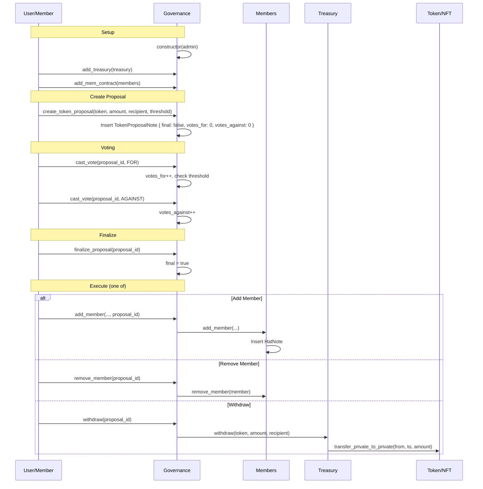
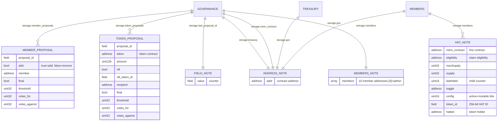

# Aztec DAO Contract Architecture

## Contract Overview

```mermaid
flowchart TB
    subgraph USER["User"]
        direction TB
        U[""]
    end

    subgraph GOVERNANCE["GOVERNANCE Contract"]
        direction TB
        G["<b>Storage</b><br/>┌─────────────────────────────────────────────────────────────────────────────────┐<br/>│ members: MembersNote { members[10]: Field }                                         │<br/>│ treasury: AddressNote { address: AztecAddress }                                    │<br/>│ mem_contract: AddressNote { address: AztecAddress }                               │<br/>│ last_proposal_id: FieldNote { value: Field }                                    │<br/>│                                                                                 │<br/>│ <b>PrivateSet Notes:</b>                                                          │<br/>│ token_proposals: TokenProposalNote {                                            │<br/>│   proposal_id, token, amount, nft, nft_token_id, recipient,                    │<br/>│   final, threshold, votes_for, votes_against }                                   │<br/>│ member_proposals: MemberProposalNote {                                         │<br/>│   proposal_id, add, member, final, threshold, votes_for, votes_against }        │<br/>└─────────────────────────────────────────────────────────────────────────────────┘"]
    end

    subgraph TREASURY["TREASURY Contract"]
        direction TB
        T["<b>Storage</b><br/>┌─────────────────────────────────────────────────┐<br/>│ gov: AddressNote { address: AztecAddress }              │<br/>│       (Governance contract address)                    │<br/>└─────────────────────────────────────────────────┘"]
    end

    subgraph MEMBERS["MEMBERS Contract"]
        direction TB
        M["<b>Storage</b><br/>┌─────────────────────────────────────────────────────────────────────────────────┐<br/>│ gov: AddressNote { address: AztecAddress }                                         │<br/>│       (Governance contract address)                                                │<br/>│                                                                                 │<br/>│ <b>PrivateSet Notes:</b>                                                          │<br/>│ members: HatNote {                                                               │<br/>│   mem_contract, eligibility, maxSupply, supply, lastHatId,                      │<br/>│   toggle, config, token_id (HAT ID), hatted }                                    │<br/>└─────────────────────────────────────────────────────────────────────────────────┘"]
    end

    subgraph EXTERNAL["External"]
        direction TB
        E["Token (ERC20) · NFT (ERC721)"]
    end

    USER -->|"1. deploy"| GOVERNANCE
    USER -->|"2. add_treasury()"| GOVERNANCE
    USER -->|"3. add_mem_contract()"| GOVERNANCE

    GOVERNANCE -->|"cross-contract"| TREASURY
    GOVERNANCE -->|"cross-contract"| MEMBERS
    TREASURY -->|"transfer()"| EXTERNAL

    GOVERNANCE -.->|"creates proposals"| E
```

---

## Proposal Flow & Cross-Contract Calls



---

## Note Structures & Access Control



---

## Access Control

| Function                        | Caller     | Check                                    |
| ------------------------------- | ---------- | ---------------------------------------- |
| Governance.create\_\*\_proposal | Member     | msg.sender in members[]                  |
| Governance.cast_vote            | Member     | msg.sender in members[]                  |
| Governance.finalize_proposal    | Admin      | msg.sender == members[0]                 |
| Governance.add_member           | Member     | msg.sender in members[] + proposal.final |
| Governance.remove_member        | Member     | msg.sender in members[] + proposal.final |
| Governance.withdraw             | Member     | msg.sender in members[] + proposal.final |
| Treasury.withdraw               | Governance | msg.sender == gov                        |
| Members.add_member              | Governance | msg.sender == gov                        |
| Members.remove_member           | Governance | msg.sender == gov                        |

---

## HATs Protocol (token_id)

```
┌────────────────────────────────────────────────────────────────────────┐
│ 256-bit Hat ID (token_id)                                             │
├────────────────────────────────────────────────────────────────────────┤
│                                                                        │
│  ┌──────────┬──────────┬──────────┬──────────┐   ┌──────────┐       │
│  │ 32 bits  │ 16 bits  │ 16 bits  │ 16 bits  │   │ 16 bits  │       │
│  │ TopHat   │ Level 0  │ Level 1  │ Level 2  │   │ Level 13 │       │
│  │ Domain   │ child 1  │ child 1  │ child 1  │   │ child 1  │       │
│  └──────────┴──────────┴──────────┴──────────┘   └──────────┘       │
│  ↑          ↑          ↑          ↑                  ↑                 │
│  bits 255   bits 223  bits 207   bits 191           bits 17          │
│  -224       -208       -192       -176                -0               │
│                                                                        │
│  MAX_LEVELS = 14 · Each level = 16 bits (max 65,536 children)       │
│                                                                        │
└────────────────────────────────────────────────────────────────────────┘
```
